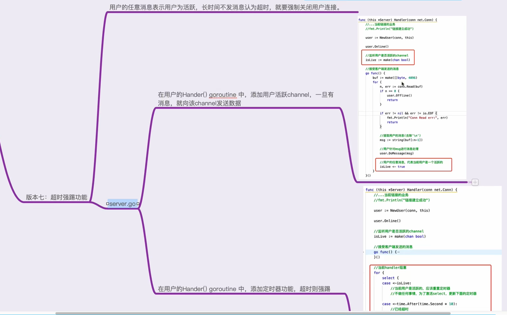
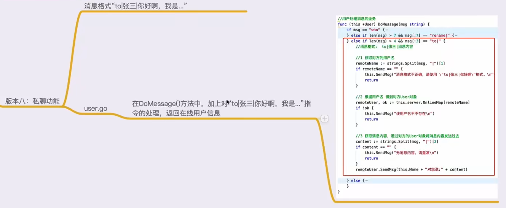
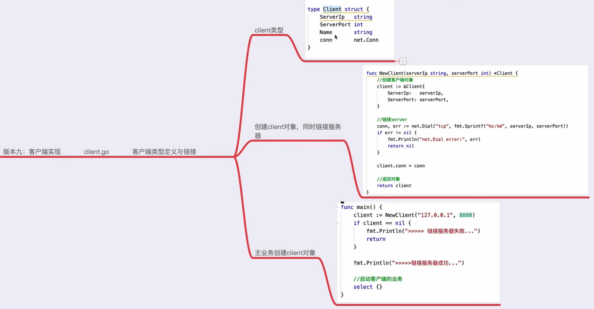

# Golang_IM_System
学习简易Go网络编程，实现一个简单即时通讯系统

## 一、构建基础server  
1、构建server类型  
2、创建一个server对象  
3、启动server服务  
4、处理链接业务  

## 二、用户上线功能
1、创建user类型  
2、创建user对象，并创建方法监听user对应的channel消息  
3、改写server：新增OnlineMap和Message属性，在处理客户端上线的Handler中创建并
添加用户，新增广播消息方法，新增监听广播消息channel的方法，然后启用协程去监听server中
的Message

## 三、将用户消息进行广播

## 四、用户业务封装

## 五、在线用户查询

## 六、修改用户名

## 七、超时强踢功能

## 八、私聊功能

## 九、客户端实现
新建一个目录用于存放client.go，因为里面有另外一个main函数与主包冲突
